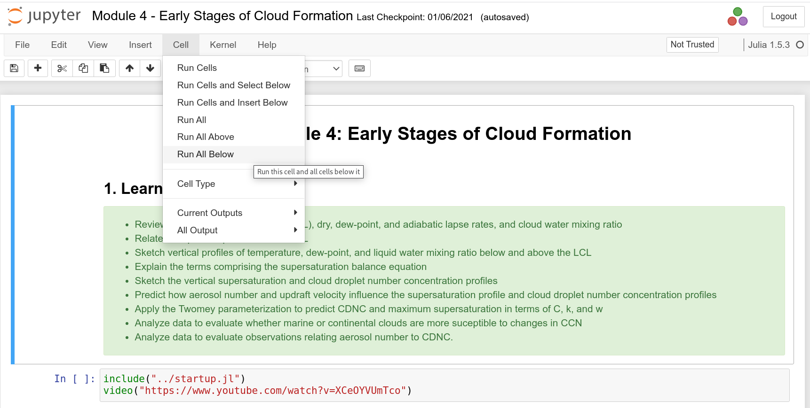
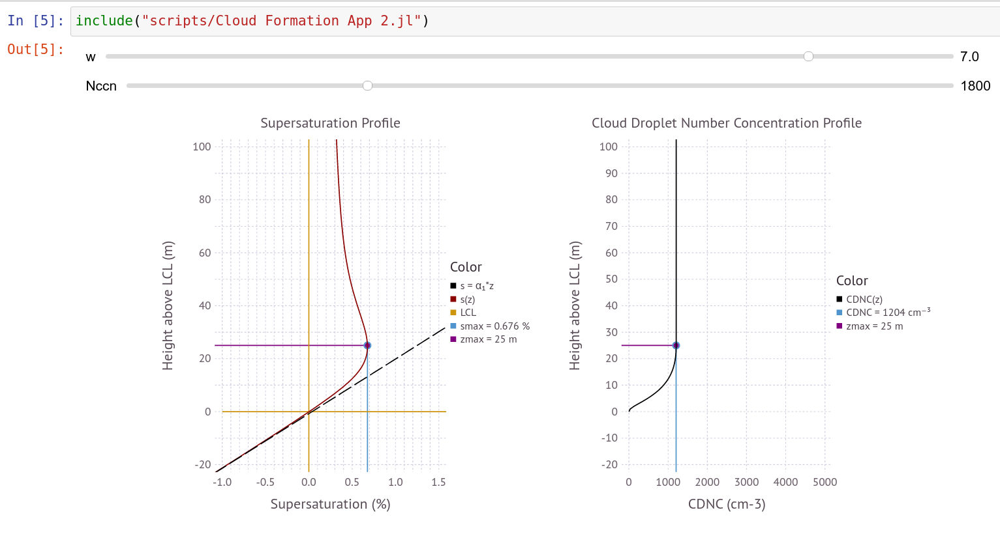

# Atmospheric Physics Notebooks

The notebooks contain instructional material, interactive web-apps, and exercises for students to engage with the material using an inquiry-based approach. Details about this project are given in [Petters, 2021](https://journals.ametsoc.org/view/journals/bams/102/3/BAMS-D-20-0072.1.xml). 

## Docker/Podman Access

Users with access to either [docker](https://docs.docker.com/get-docker/) or [podman](https://podman.io/getting-started/installation) can bypass the server and run the containers on their own hardware using the following command

```bash
docker run -it -p 8888:8888 docker.io/mdpetters/apn:latest
```

or

```bash
podman run -it -p 8888:8888 docker.io/mdpetters/apn:latest
```

## How to Use

Use the Jupyter file manager to navigate to a notebook. For example, load the file ```Module 4 - Early Stages of Cloud Formation.ipynb```. Make sure to wait until the kernel is initialized. The select "Run All Below".  



The cursor will jump to the end of the notebook. The entire notebook will be executed, which will take a few seconds. Then navigate back to the beginning of the notebook or an app of your choice. Below is an example of parcel model app. Use the sliders to change inputs. The graph should update near instantaneously. 



## Source Repository

This project is hosted on [GitHub](https://github.com/mdpetters/Atmospheric-Physics-Notebooks). Detailed documentation about the project is provided [here](https://mdpetters.github.io/Atmospheric-Physics-Notebooks/v2008/).  

